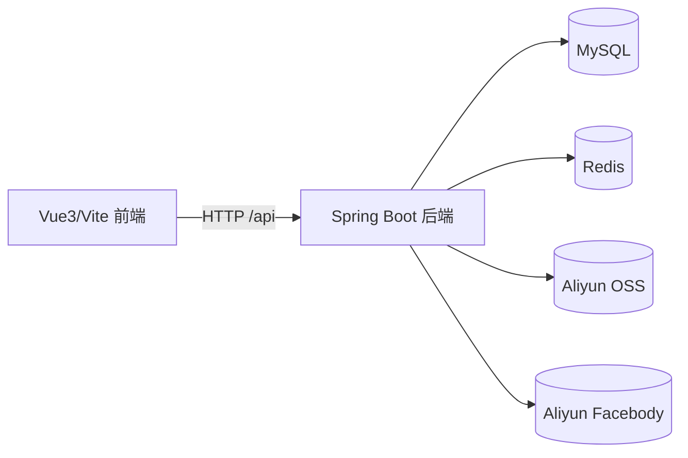
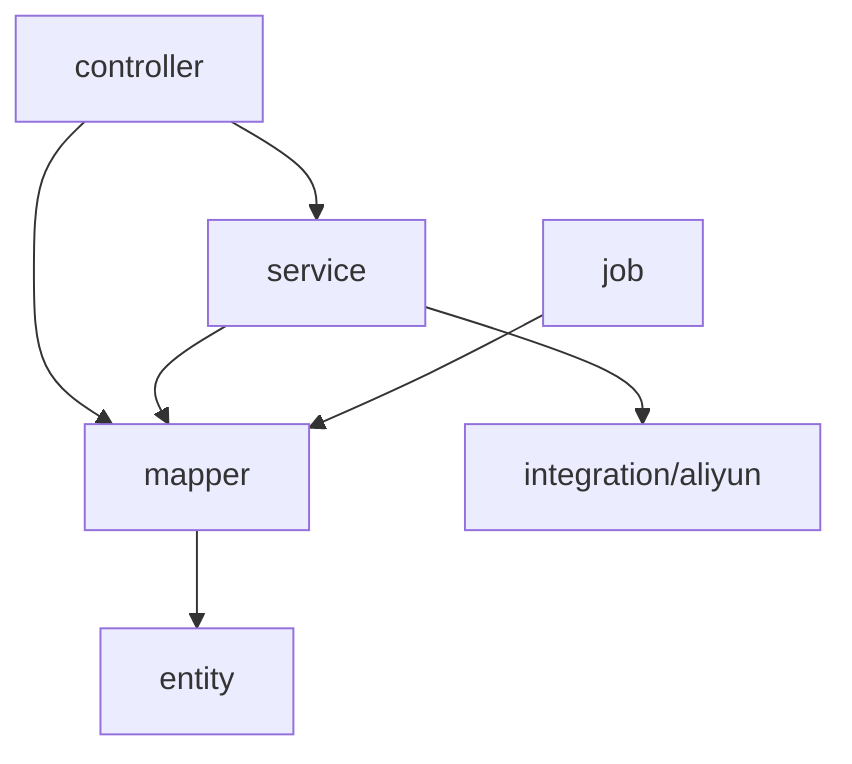
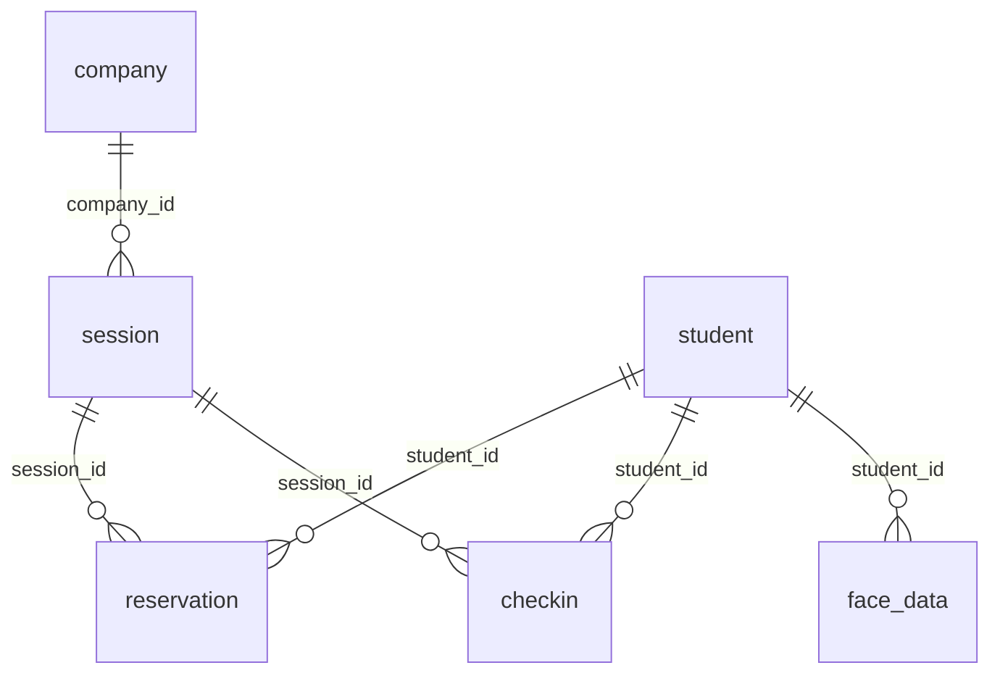

# Code Wiki（校园宣讲会预约签到系统）

## 1. 项目概览

本仓库实现了一个“校园宣讲会预约与人脸签到系统”，支持三类角色与一个现场终端场景：

- 学生：浏览宣讲会、预约/取消、查看历史、上传人脸底片、现场刷脸签到
- 企业：注册后等待审核、创建/修改/发布/取消宣讲会、查看签到名单
- 管理员：企业入驻审核、宣讲会审核与叫停、学生管理、统计与看板
- 现场终端（Kiosk）：在宣讲会现场通过摄像头采集的人脸图片进行识别并完成签到

后端为 Spring Boot + MyBatis-Plus，前端为 Vue3 + Vite（前端工程放在后端 resources 下，但运行时作为独立前端开发服务器使用）。

## 2. 技术栈与外部依赖

### 2.1 后端（Maven / Spring Boot）

- 语言与运行时：Java 17
- Web：Spring Boot Web（REST API）
- 数据层：MyBatis-Plus（Boot3 Starter）+ MySQL Connector/J
- 安全：Spring Security（当前配置为 permitAll + BCryptPasswordEncoder）
- Redis：spring-boot-starter-data-redis（代码中暂未见到显式使用点，通常用于缓存/会话/限流等）
- 第三方：阿里云 Facebody（人脸检测/入库/检索）、阿里云 OSS（底片上传）
- 文档/导出：Apache POI（Excel 导出，使用点见管理端相关控制器）

依赖清单见 [pom.xml](file:///workspace/reservation/pom.xml)。

### 2.2 前端（Vite / Vue3）

- Vue 3 + Vue Router + Pinia
- UI：Element Plus + @element-plus/icons-vue
- 图表：ECharts
- 网络：Axios（封装见 [request.js](file:///workspace/reservation/src/main/resources/frontend/src/utils/request.js)）

依赖清单见 [package.json](file:///workspace/reservation/src/main/resources/frontend/package.json)。

### 2.3 外部系统

- MySQL 8：业务主库（表结构见 [reservation.sql](file:///workspace/reservation/src/main/resources/db/reservation.sql)）
- Redis：缓存/扩展能力（配置见 [application.yaml](file:///workspace/reservation/src/main/resources/application.yaml#L9-L13)）
- 阿里云：
  - Facebody：人脸检测 + 人脸库检索（SDK 客户端见 [AliyunClients](file:///workspace/reservation/src/main/java/com/iflytek/reservation/integration/aliyun/AliyunClients.java)）
  - OSS：人脸底片存储

## 3. 仓库结构

```
/workspace
  ├─ reservation/                          # 后端 Maven 工程根
  │  ├─ pom.xml
  │  ├─ mvnw / mvnw.cmd                    # Maven Wrapper
  │  └─ src/
  │     ├─ main/
  │     │  ├─ java/com/iflytek/reservation/ # 后端主代码（分层包结构）
  │     │  └─ resources/
  │     │     ├─ application.yaml           # Spring Boot 配置
  │     │     ├─ db/reservation.sql         # MySQL 初始化脚本
  │     │     └─ frontend/                  # 前端 Vue3/Vite 工程（独立运行）
  │     └─ test/java/...                    # 单元测试
  └─ *.md / *.docx                          # 需求/规划/操作指南等文档
```

前端入口：

- Vite 入口：[main.js](file:///workspace/reservation/src/main/resources/frontend/src/main.js)
- HTML 入口：[index.html](file:///workspace/reservation/src/main/resources/frontend/index.html)
- 路由：[router/index.js](file:///workspace/reservation/src/main/resources/frontend/src/router/index.js)

后端入口：

- Spring Boot main：[ReservationApplication](file:///workspace/reservation/src/main/java/com/iflytek/reservation/ReservationApplication.java)

## 4. 整体架构

### 4.1 逻辑架构（分层）

- Presentation（Controller）：对外提供 REST API（统一前缀 `/api`）
- Domain（Service）：业务规则与事务（例如签到事务、人脸注册流程、账号策略）
- Persistence（Mapper + Entity）：MyBatis-Plus 访问 MySQL
- Integration：阿里云 Facebody/OSS 客户端封装
- Job：定时任务，处理“宣讲会状态归档”等后台流程

### 4.2 运行时组件关系



### 4.3 内部依赖（后端）



## 5. 后端模块说明（com.iflytek.reservation）

### 5.1 config：框架配置

- [SecurityConfig](file:///workspace/reservation/src/main/java/com/iflytek/reservation/config/SecurityConfig.java)
  - 提供 `PasswordEncoder`（BCrypt）
  - 当前 `SecurityFilterChain` 直接 `permitAll()`，仅关闭 CSRF
- [MybatisPlusConfig](file:///workspace/reservation/src/main/java/com/iflytek/reservation/config/MybatisPlusConfig.java)
  - 注册 `MybatisPlusInterceptor`（当前未挂分页等内部插件）

### 5.2 common：通用能力

- [Result](file:///workspace/reservation/src/main/java/com/iflytek/reservation/common/Result.java)
  - 统一响应结构：`{ code, message, data }`
- [AuthTokenUtil](file:///workspace/reservation/src/main/java/com/iflytek/reservation/common/AuthTokenUtil.java)
  - 从 `Authorization` Header 提取用户 ID
  - 支持 `Bearer <token>` 与 `token-<id>` 两种形式，本项目实际使用 `token-<id>`
- [IndustryUtil](file:///workspace/reservation/src/main/java/com/iflytek/reservation/common/IndustryUtil.java)
  - 企业行业字段规范化（注册时校验）

### 5.3 entity：核心领域模型（与表结构一一对应）

实体类位于 [entity](file:///workspace/reservation/src/main/java/com/iflytek/reservation/entity)：

- Admin：管理员（role/status）
- Student：学生（status/封禁时间等）
- Company：企业（审核/入驻/注销状态）
- Session：宣讲会（生命周期状态、容量、签到窗口）
- Reservation：预约记录（预约/取消/签到/爽约）
- Checkin：签到记录（准时/迟到）
- FaceData：人脸底片特征与 OSS URL

表结构与状态枚举建议以 [reservation.sql](file:///workspace/reservation/src/main/resources/db/reservation.sql) 为准。

### 5.4 mapper：数据访问层

Mapper 位于 [mapper](file:///workspace/reservation/src/main/java/com/iflytek/reservation/mapper)，均为 MyBatis-Plus `BaseMapper` 派生。

### 5.5 service：核心业务

- 登录/注册/改密
  - 学生：[StudentService](file:///workspace/reservation/src/main/java/com/iflytek/reservation/service/StudentService.java) / [StudentServiceImpl](file:///workspace/reservation/src/main/java/com/iflytek/reservation/service/impl/StudentServiceImpl.java)
  - 企业：[CompanyService](file:///workspace/reservation/src/main/java/com/iflytek/reservation/service/CompanyService.java) / [CompanyServiceImpl](file:///workspace/reservation/src/main/java/com/iflytek/reservation/service/impl/CompanyServiceImpl.java)
  - 管理员：[AdminService](file:///workspace/reservation/src/main/java/com/iflytek/reservation/service/AdminService.java) / [AdminServiceImpl](file:///workspace/reservation/src/main/java/com/iflytek/reservation/service/impl/AdminServiceImpl.java)
- 签到事务
  - [KioskCheckinService.checkin](file:///workspace/reservation/src/main/java/com/iflytek/reservation/service/KioskCheckinService.java#L31-L91)
- 人脸能力
  - 注册/上传/同步到人脸库：[FaceRegisterService.register](file:///workspace/reservation/src/main/java/com/iflytek/reservation/service/FaceRegisterService.java#L59-L165)
  - 人脸检索 Top1：[FaceSearchService.searchTop](file:///workspace/reservation/src/main/java/com/iflytek/reservation/service/FaceSearchService.java#L26-L63)

### 5.6 integration：第三方集成

- [AliyunClients](file:///workspace/reservation/src/main/java/com/iflytek/reservation/integration/aliyun/AliyunClients.java)
  - 延迟初始化 Facebody Client / OSS Client
  - 依赖环境变量：`ALIBABA_CLOUD_ACCESS_KEY_ID`、`ALIBABA_CLOUD_ACCESS_KEY_SECRET`
  - OSS 可选环境变量：`RESERVATION_OSS_BUCKET`、`RESERVATION_OSS_ENDPOINT`

### 5.7 job：定时任务

- [SessionArchiveJob](file:///workspace/reservation/src/main/java/com/iflytek/reservation/job/SessionArchiveJob.java)
  - 每 60 秒扫描：将 `session_status=2` 且 `end_time < now` 的宣讲会更新为 `session_status=3`（已结束）

## 6. 关键业务流程

### 6.1 认证与“Token”机制（实现现状）

登录接口返回的是用户信息，不返回服务端签发的 token。前端在登录成功后直接基于用户 ID 构造 token 并存储到 LocalStorage：

- 前端构造 token：[login/index.vue:L178](file:///workspace/reservation/src/main/resources/frontend/src/views/login/index.vue#L176-L180)
  - `token-${user.id || user.studentId || user.companyId || user.adminId}`
- 请求时携带到 Header：
  - Axios 注入 `Authorization: Bearer ${token}`：[request.js:L11-L16](file:///workspace/reservation/src/main/resources/frontend/src/utils/request.js#L11-L16)
- 后端提取：
  - [AuthTokenUtil.extractId](file:///workspace/reservation/src/main/java/com/iflytek/reservation/common/AuthTokenUtil.java#L6-L29) 将 `Bearer token-<id>` 解析为 Long

注意：当前后端 Security 配置为全放行（[SecurityConfig](file:///workspace/reservation/src/main/java/com/iflytek/reservation/config/SecurityConfig.java#L21-L29)），接口“鉴权”主要依赖控制器里对 `extractId()` 的空值判断与角色/状态判断（例如管理员的 `isSuperAdmin`）。

### 6.2 宣讲会生命周期（Session）

状态枚举来自表结构（[session.session_status](file:///workspace/reservation/src/main/resources/db/reservation.sql#L144-L169)）：

- 0：待审（企业创建/修改后进入）
- 1：已审核（管理员 approve 后进入，等待企业发布）
- 2：已发布（企业 publish 后进入，可被学生预约与签到）
- 3：已结束（定时任务归档或业务更新）
- 4：已取消（企业取消或管理员叫停）
- 5：已驳回（管理员 reject 后进入，企业可修改后重新提交）

主链路：

1. 企业创建宣讲会：`POST /api/company/session`（见 [CompanySessionController](file:///workspace/reservation/src/main/java/com/iflytek/reservation/controller/CompanySessionController.java#L113-L145)）
2. 管理员审核：
   - `POST /api/admin/session/{id}/audit` action=approve/reject/update/cancel（见 [AdminController.auditSession](file:///workspace/reservation/src/main/java/com/iflytek/reservation/controller/AdminController.java#L360-L442)）
3. 企业发布：`POST /api/company/session/{id}/publish`（见 [CompanySessionController.publishSession](file:///workspace/reservation/src/main/java/com/iflytek/reservation/controller/CompanySessionController.java#L189-L219)）
   - 发布时计算签到窗口：`startTime - 20min` ~ `startTime + 15min`
4. 自动归档：见 [SessionArchiveJob](file:///workspace/reservation/src/main/java/com/iflytek/reservation/job/SessionArchiveJob.java#L18-L26)

### 6.3 学生预约（Reservation）与名额扣减

状态枚举来自表结构（[reservation.reservation_status](file:///workspace/reservation/src/main/resources/db/reservation.sql#L118-L133)）：

- 0：正常（已预约未签到）
- 1：已取消
- 2：已签到
- 3：爽约

预约入口：

- `POST /api/student/reserve/{sessionId}`：[StudentReservationController.reserve](file:///workspace/reservation/src/main/java/com/iflytek/reservation/controller/StudentReservationController.java#L36-L87)
  - 校验学生状态（含自动封禁策略，见 `refreshStudentStatus`）
  - 校验宣讲会可预约且未开始
  - CAS 风格扣减余量：`remaining_seats = remaining_seats - 1` 且 `remaining_seats > 0`
  - 插入 reservation 记录（status=0）

取消预约入口：

- `POST /api/student/reservation/cancel?reservationId=...`：[StudentHistoryController.cancelReservation](file:///workspace/reservation/src/main/java/com/iflytek/reservation/controller/StudentHistoryController.java#L92-L133)
  - reservation status 0 -> 1
  - `remaining_seats = remaining_seats + 1`

### 6.4 现场刷脸签到（人脸检索 + 事务签到）

核心入口：

- `POST /api/checkin/verify/{sessionId}`：[CheckinController.verify](file:///workspace/reservation/src/main/java/com/iflytek/reservation/controller/CheckinController.java#L76-L111)
  1. 解码 base64 图片
  2. 调用 [FaceSearchService.searchTop](file:///workspace/reservation/src/main/java/com/iflytek/reservation/service/FaceSearchService.java#L26-L63) 获取 Top1 匹配与置信度
  3. 置信度阈值：`score >= 80`
  4. 将 `entityId` 解析为 `studentId`
  5. 调用 [KioskCheckinService.checkin](file:///workspace/reservation/src/main/java/com/iflytek/reservation/service/KioskCheckinService.java#L31-L91)：
     - 校验 reservation 是否存在且 status=0
     - 插入 checkin（checkin_status：0 准时 / 1 迟到；迟到判断基于 `checkin_end`）
     - reservation status 0 -> 2

人脸注册入口（学生侧）：

- `POST /api/checkin/face-register`：Multipart 上传图片，见 [CheckinController.faceRegister](file:///workspace/reservation/src/main/java/com/iflytek/reservation/controller/CheckinController.java#L60-L74)
- 核心流程见 [FaceRegisterService.register](file:///workspace/reservation/src/main/java/com/iflytek/reservation/service/FaceRegisterService.java#L59-L165)：
  - 校验格式与大小（< 5MB）
  - Facebody DetectFace（需要单人脸且质量分 >= 85）
  - OSS 上传底片，写入 face_data（特征 base64 + faceUrl）
  - 同步到 Facebody 人脸库（dbName 默认 `reservation_face_date`，可通过 `RESERVATION_FACE_DB_NAME` 覆盖）

### 6.5 学生封禁/解封策略

逻辑位于 [StudentServiceImpl.refreshStudentStatus](file:///workspace/reservation/src/main/java/com/iflytek/reservation/service/impl/StudentServiceImpl.java#L82-L130)：

- 自动解封：status=0 且 `limit_time + 7days <= now` -> status=1，记录 `unban_time`
- 自动封禁：status=1 时统计解封后的行为：
  - 爽约次数（reservation_status=3）>= 3 或
  - 迟到次数（checkin_status in 1,2）>= 5
  - 触发封禁：status=0，写入 `limit_time=now`

## 7. API 模块（按 Controller 划分）

以 `/api` 为统一前缀，各模块控制器如下（建议从命名与 RequestMapping 进行定位）：

- 认证：
  - `/api/auth`：[LoginController](file:///workspace/reservation/src/main/java/com/iflytek/reservation/controller/LoginController.java)
- 学生：
  - `/api/student`：宣讲会列表/详情：[StudentSessionController](file:///workspace/reservation/src/main/java/com/iflytek/reservation/controller/StudentSessionController.java)
  - `/api/student`：预约：[StudentReservationController](file:///workspace/reservation/src/main/java/com/iflytek/reservation/controller/StudentReservationController.java)
  - `/api/student`：历史与取消：[StudentHistoryController](file:///workspace/reservation/src/main/java/com/iflytek/reservation/controller/StudentHistoryController.java)
  - `/api/student`：个人信息：[StudentController](file:///workspace/reservation/src/main/java/com/iflytek/reservation/controller/StudentController.java)
  - `/api/student/dashboard`：看板：[StudentDashboardController](file:///workspace/reservation/src/main/java/com/iflytek/reservation/controller/StudentDashboardController.java)
- 企业：
  - `/api/company`：宣讲会发布与管理：[CompanySessionController](file:///workspace/reservation/src/main/java/com/iflytek/reservation/controller/CompanySessionController.java)
  - `/api/company`：企业资料：[CompanyController](file:///workspace/reservation/src/main/java/com/iflytek/reservation/controller/CompanyController.java)
  - `/api/company`：预约与签到名单：[CompanyCheckinRecordsController](file:///workspace/reservation/src/main/java/com/iflytek/reservation/controller/CompanyCheckinRecordsController.java)
  - `/api/company/dashboard`：看板：[CompanyDashboardController](file:///workspace/reservation/src/main/java/com/iflytek/reservation/controller/CompanyDashboardController.java)
- 管理端：
  - `/api/admin`：企业/宣讲会/学生管理（含审核与叫停）：[AdminController](file:///workspace/reservation/src/main/java/com/iflytek/reservation/controller/AdminController.java)
  - `/api/admin`：管理员账号管理：[AdminAccountController](file:///workspace/reservation/src/main/java/com/iflytek/reservation/controller/AdminAccountController.java)
  - `/api/admin/dashboard`：看板：[AdminDashboardController](file:///workspace/reservation/src/main/java/com/iflytek/reservation/controller/AdminDashboardController.java)
  - `/api/admin/statistics`：统计导出：[AdminStatisticsController](file:///workspace/reservation/src/main/java/com/iflytek/reservation/controller/AdminStatisticsController.java)
- 签到/人脸：
  - `/api/checkin`：[CheckinController](file:///workspace/reservation/src/main/java/com/iflytek/reservation/controller/CheckinController.java)

## 8. 数据库设计（MySQL）

### 8.1 表与关系

主要业务表：

- `student`：学生账户
- `company`：企业账户（含审核状态）
- `admin`：管理员账户
- `session`：宣讲会（核心表）
- `reservation`：预约记录（student <-> session 关联）
- `checkin`：签到记录（student <-> session 关联）
- `face_data`：学生人脸特征与底片 URL

关系示意：



### 8.2 初始化与样例数据

初始化脚本： [reservation.sql](file:///workspace/reservation/src/main/resources/db/reservation.sql)

- 内置默认管理员：
  - admin/admin：密码为明文 `123456`（见 [reservation.sql:L38-L39](file:///workspace/reservation/src/main/resources/db/reservation.sql#L38-L39)）
  - Admin 登录兼容“BCrypt 与明文”两种匹配方式（见 [AdminServiceImpl.login](file:///workspace/reservation/src/main/java/com/iflytek/reservation/service/impl/AdminServiceImpl.java#L18-L29)）

## 9. 前端工程说明（frontend）

前端目录： [resources/frontend](file:///workspace/reservation/src/main/resources/frontend)

### 9.1 目录职责

- `src/api/*`：按业务域封装 API（auth/admin/student/company/checkin）
- `src/utils/request.js`：Axios 实例、token 注入、统一错误处理
- `src/router/index.js`：路由表 + 路由守卫（requiresAuth/role/adminRoleLevel）
- `src/store/user.js`：Pinia 用户态与 localStorage 持久化
- `src/views/*`：页面（按角色分目录）
- `src/layout/*`：布局（StandardLayout/BlankLayout）

### 9.2 路由与权限

路由守卫见 [router/index.js](file:///workspace/reservation/src/main/resources/frontend/src/router/index.js#L158-L177)：

- `requiresAuth`：无 token 则跳转 `/login`
- `meta.role`：与 `userStore.role` 不一致则跳转 `/403`
- `adminRoleLevel === 2`（普通管理员）限制 admin 路由访问范围

## 10. 配置与环境变量

### 10.1 application.yaml（后端）

见 [application.yaml](file:///workspace/reservation/src/main/resources/application.yaml)：

- MySQL：`spring.datasource.*`
- Redis：`spring.data.redis.*`
- 上传大小限制：`spring.servlet.multipart.*`
- MyBatis-Plus：mapper 扫描、驼峰映射、stdout 日志
- server.port：默认 8080

### 10.2 阿里云相关环境变量（后端运行必需，若启用人脸功能）

由 [AliyunClients](file:///workspace/reservation/src/main/java/com/iflytek/reservation/integration/aliyun/AliyunClients.java#L31-L60) 与人脸服务类使用：

- 必需：
  - `ALIBABA_CLOUD_ACCESS_KEY_ID`
  - `ALIBABA_CLOUD_ACCESS_KEY_SECRET`
- 可选：
  - `RESERVATION_OSS_BUCKET`（默认 `reservation-signin-system`）
  - `RESERVATION_OSS_ENDPOINT`（默认 `https://oss-cn-hangzhou.aliyuncs.com`）
  - `RESERVATION_FACE_DB_NAME`（默认 `reservation_face_date`）

## 11. 本地运行方式

### 11.1 前置条件

- JDK 17
- MySQL 8（创建 schema `reservation` 并导入初始化脚本）
- Redis（默认 localhost:6379）
- Node.js（建议 18+）与 pnpm（前端使用 pnpm-lock.yaml）

### 11.2 启动后端

在后端工程根目录执行：

```bash
cd /workspace/reservation
./mvnw spring-boot:run
```

默认监听：`http://localhost:8080`（见 [application.yaml:L28-L29](file:///workspace/reservation/src/main/resources/application.yaml#L28-L29)）。

### 11.3 初始化数据库

建议流程：

1. 在 MySQL 创建库：`CREATE DATABASE reservation DEFAULT CHARACTER SET utf8mb4;`
2. 执行初始化脚本：[reservation.sql](file:///workspace/reservation/src/main/resources/db/reservation.sql)
3. 确认后端配置与数据库账号一致（见 [application.yaml:L4-L8](file:///workspace/reservation/src/main/resources/application.yaml#L4-L8)）

### 11.4 启动前端（开发模式）

```bash
cd /workspace/reservation/src/main/resources/frontend
pnpm install
pnpm dev
```

- 默认端口：3000（见 [vite.config.js](file:///workspace/reservation/src/main/resources/frontend/vite.config.js#L13-L21)）
- 开发代理：`/api -> http://localhost:8080`（见同文件）

### 11.5 生产构建（前端）

```bash
cd /workspace/reservation/src/main/resources/frontend
pnpm build
```

产物默认在 `dist/`。当前后端工程未包含“自动托管 dist”或“构建时复制到 `resources/static`”的逻辑；若希望由后端统一托管静态资源，可将 `dist/` 拷贝到后端的 `src/main/resources/static/`（并调整路由/部署策略）。

## 12. 验证与测试

后端单测入口：

- [ReservationApplicationTests](file:///workspace/reservation/src/test/java/com/iflytek/reservation/ReservationApplicationTests.java)

常用命令：

```bash
cd /workspace/reservation
./mvnw test
./mvnw -DskipTests package
```

## 13. 已知设计特点与风险提示（便于后续演进）

- 当前“token”并非服务端签发，也未做签名/过期校验；只要知道某个用户 ID 即可构造 Authorization Header（见 [AuthTokenUtil](file:///workspace/reservation/src/main/java/com/iflytek/reservation/common/AuthTokenUtil.java) 与前端 [login/index.vue](file:///workspace/reservation/src/main/resources/frontend/src/views/login/index.vue#L176-L180)）。
- Spring Security 目前全放行（[SecurityConfig](file:///workspace/reservation/src/main/java/com/iflytek/reservation/config/SecurityConfig.java#L21-L29)），权限控制主要依赖控制器方法内判断。
- `application.yaml` 中包含数据库明文密码示例，生产环境建议通过外部配置（环境变量/配置中心）管理，并为不同环境拆分 profile。

